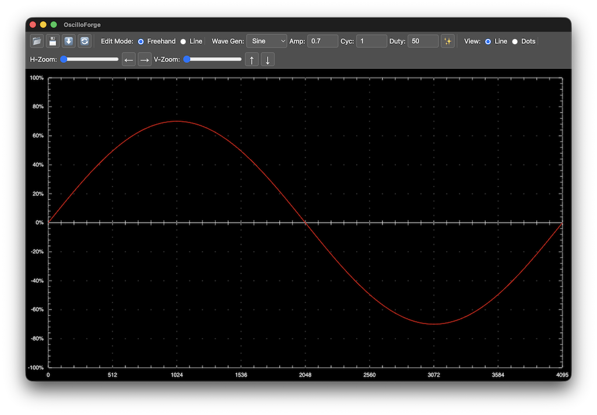

# OscilloForge

[](https://opensource.org/licenses/ISC)
[](https://www.electronjs.org/)
[](https://vitest.dev/)
[](https://eslint.org/)
[](https://github.com/batk0/OsciloForge/actions/workflows/tests.yml)
[](https://codecov.io/gh/batk0/OsciloForge)



## Overview

OscilloForge is a cross-platform desktop waveform editor built with Electron. It provides a set of tools for creating, viewing, and manipulating waveform data, inspired by the functionality of software for digital storage oscilloscopes.

The application features a responsive UI that adapts to the window size and a dark theme suitable for technical applications.

## Features

-   **File Operations:** Open and save waveform data in both CSV and the proprietary ARB format.
-   **Waveform Generation:** Generate standard **Sine**, **Square**, and **Triangle** waves with adjustable amplitude, cycles, and duty cycle.
-   **Interactive Editing:**
    -   **Freehand Drawing:** Click and drag to draw the waveform.
    -   **Line Drawing:** Click to set points and draw connected straight lines.
-   **Advanced Navigation:**
    -   Independent horizontal and vertical zoom.
    -   Fluid panning in all directions.
    -   **Mouse Controls:** Use `Shift + Drag` to pan and `Cmd/Ctrl + Drag` to perform a direction-locked zoom.
-   **Dynamic Grid:** An oscilloscope-style grid that dynamically adjusts its density as you zoom, providing a clear and constant visual reference.

## Getting Started

### Prerequisites

-   [Node.js](https://nodejs.org/) and npm must be installed on your system.

### Installation

1.  Clone the repository or download the source code.
2.  Navigate to the project directory and install the dependencies:
    ```bash
    npm install
    ```

### Running the Application

To start OscilloForge in development mode, run the following command:

```bash
npm start
```

## License

This project is licensed under the ISC License.
